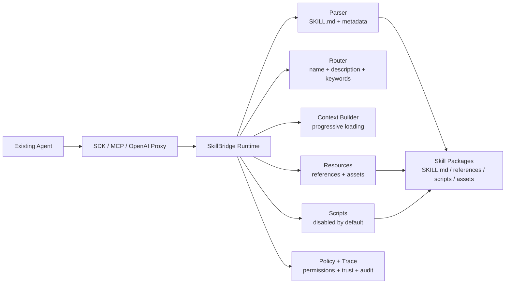

# agent-skill-bridge

Run Agent Skills in any existing agent without rewriting a skill runtime.

Agent Skill Bridge parses `SKILL.md`, routes user tasks to skills, progressively loads instructions and resources, exposes tools through SDK/MCP/OpenAI-compatible proxy, and traces every runtime decision.

One sentence: SkillBridge is a progressive Skill runtime layer for existing agents, turning local `SKILL.md` packages into routed instructions, safe resources, optional scripts, and auditable tool calls.

Its core value is bringing the Agent Skills progressive disclosure model to any agent: skill directories contain `SKILL.md`; `name`, `description`, and `metadata.keywords` are available for lightweight routing; the full `SKILL.md` body is loaded only when a task selects that skill; references, scripts, and assets are read or executed only when needed.

中文说明：SkillBridge 是一个面向现有 Agent 的渐进式 Skill runtime。它不发明新标准，而是把本地 `SKILL.md` 技能包变成可路由的指令、可安全读取的资源、可选执行的脚本，以及可审计的运行轨迹。

It does not define a new skill standard or marketplace. It bridges existing `SKILL.md` packages into real agent execution loops.

## Architecture



## 30 Second Demo

```bash
pnpm install
pnpm build
pnpm skillbridge scan examples/skills
pnpm skillbridge search examples/skills "PR risk review"
pnpm skillbridge activate examples/skills "PR risk review" --budget 4000
pnpm skillbridge exec examples/skills "PR risk review" --enable-scripts
```

Expected result: `Code Review` is selected, the system patch includes the selected skill body, and resources/scripts remain available through runtime tools instead of being dumped into the prompt.

## Choose An Integration

| Integration  | Best For                                                               | What You Change                                                 | SkillBridge Handles                                                              |
| ------------ | ---------------------------------------------------------------------- | --------------------------------------------------------------- | -------------------------------------------------------------------------------- |
| SDK          | You own the agent runtime or app code                                  | Import `@skillbridge/core` and call `runtime.prepare()` / tools | Routing, progressive context, resource reads, script execution, trace            |
| MCP Server   | Claude Desktop, Cursor, LibreChat, OpenCode-style tool hosts           | Add a local MCP server command                                  | Native tools/resources/prompts, `skillId` lookup, policy gates                   |
| OpenAI Proxy | Existing OpenAI-compatible agents where changing `base_url` is easiest | Point `base_url` at the proxy                                   | System patch injection, OpenAI tools, optional internal tool loop, trace headers |

## Minimal Examples

SDK:

```ts
import { SkillBridgeRuntime } from "@skillbridge/core";

const runtime = new SkillBridgeRuntime(["./examples/skills"]);
await runtime.init();

const prepared = await runtime.prepare({
  messages: [{ role: "user", content: "PR risk review" }],
  userMessage: "PR risk review",
});

console.log(prepared.systemPatch);
```

MCP Server:

```bash
pnpm build
node packages/mcp-server/dist/server.js --skill-dir ./examples/skills
```

OpenAI Proxy:

```bash
pnpm build
SKILLBRIDGE_TARGET_BASE_URL=https://api.openai.com \
SKILLBRIDGE_TARGET_API_KEY=$OPENAI_API_KEY \
SKILLBRIDGE_SKILL_DIR=./examples/skills \
SKILLBRIDGE_PROXY_MODE=loop \
node packages/openai-proxy/dist/server.js
```

## Features

- Parse `SKILL.md` frontmatter and markdown body.
- Discover nested skill packages from one or more skill roots.
- Route user queries to relevant skills with keyword, name, description, and Chinese bigram matching.
- Use a pluggable routing layer with `RuleRouter` today and extension points for embedding and LLM reranking.
- Build progressive runtime context for selected skills without inlining resources.
- Enforce policy checks for permissions, trust levels, allowlists, and audit traces.
- Read skill resources safely from inside the skill directory.
- Execute local scripts from `scripts/` only, disabled by default.
- Expose tools through MCP with `skillId` based access.
- Proxy OpenAI-compatible chat completions with Skill context injection.
- Intercept OpenAI tool calls for `skillbridge_read_resource` and `skillbridge_run_script`.
- Maintain runtime trace events and expose trace IDs from the proxy.

## Packages

```text
packages/
  core/          Skill parsing, routing, context, resources, runtime, trace
  cli/           skillbridge command line tools
  mcp-server/    MCP server exposing SkillBridge tools
  openai-proxy/  OpenAI-compatible proxy with tool interception
  policy/        Permission, trust, allowlist, scanner, and audit policy
  adapters/      Adapter stubs for agent integrations
  sandbox/       Local script execution utilities
```

## Install

```bash
pnpm install
pnpm build
pnpm test
```

## Skill Format

A skill is a directory containing `SKILL.md` plus optional `references/`, `scripts/`, and `assets/` folders.

```markdown
---
id: code-review
name: Code Review
description: Review code changes for correctness and risk
version: 0.1.0
license: MIT
author: Skill Team
compatibility:
  agents: Claude, Cursor
  runtimes: node
permissions:
  read: references/**
  network: false
  execute: false
metadata:
  keywords: review, PR, risk
  domains: software engineering
  taskTypes: review, debugging
allowed-tools:
  - readResource
  - runScript
denied-tools:
  - shell
---

# Code Review

Core instructions for using this skill.
```

Supported frontmatter fields:

- `name` and `description` are required.
- `version`, `license`, `author`, `compatibility`, `allowed-tools`, `denied-tools`, `permissions`, and `entrypoints` are optional.
- `compatibility` can declare `agents`, `runtimes`, and `models`.
- `metadata.keywords`, `metadata.domains`, and `metadata.taskTypes` can be string arrays or comma-separated strings.
- Raw frontmatter is preserved on `manifest.rawFrontmatter`.

## SDK Usage

```ts
import { SkillBridgeRuntime } from "@skillbridge/core";

const runtime = new SkillBridgeRuntime(["./examples/skills"]);
await runtime.init();

const prepared = await runtime.prepare({
  messages: [{ role: "user", content: "PR risk review" }],
  userMessage: "PR risk review",
});

console.log(prepared.activeSkills);
console.log(prepared.systemPatch);
console.log(runtime.getTrace());
```

## Progressive Runtime

SkillBridge is a progressive runtime, not a prompt concatenator.

- Level 0: the catalog loads only skill `name`, `description`, and `metadata.keywords` for routing.
- Level 1: after activation, the selected `SKILL.md` body is loaded into `systemPatch`.
- Level 2: reference files stay out of the prompt and are read only through `readResource`.
- Level 3: scripts and assets stay deferred until an explicit tool call requests them.

中文说明：SkillBridge 不会把 references、scripts、assets 一次性塞进系统提示。它先用轻量目录做路由，只在命中技能后加载该技能的 `SKILL.md` 正文；长文档、表单、检查清单、脚本和二进制资源都通过工具按需读取或执行。

Useful runtime layers:

- L0 Discovery: `listSkills()` returns only `name`, `description`, `keywords`, and capabilities.
- L1 Activation: `activateSkill(query)` returns `ActivationDecision`, `systemPatch`, candidates, confidence, allowed tools, and next actions.
- L2 Resource Loading: `listResources(skillId)` and `readResource(skillId, resourcePath)` defer reference files until needed.
- L3 Execution: `runScript(skillId, scriptPath, options)` runs approved scripts only when explicitly enabled.
- Compatibility: `prepare()` still returns the legacy SDK shape, and object-form `readResource()` / `runScript()` remain supported.
- Trace: `getTrace()` and `clearTrace()` inspect or reset runtime trace events.

## Search Behavior

`searchSkills(query, skills, options)` returns normalized scores from `0` to `1`.

```ts
searchSkills("Zemax CAD 图纸", skills, {
  topK: 5,
  minScore: 0.15,
});
```

Ranking gives high weight to exact or contained skill names and `metadata.keywords`, medium weight to descriptions, and adds character bigram matching for Chinese queries.

For reusable routing decisions, use `routeSkills()` or `RuleRouter`. They return an `ActivationDecision`:

```ts
{
  runId: "run_xxx",
  query: "PR risk review",
  selected: true,
  selectedSkill: { id: "code-review", name: "Code Review" },
  skill, // compatibility: full selected manifest
  candidates, // compatibility: ranked SkillSearchResult[] with skillId/name/reasons
  confidence: 0.82,
  systemPatch: "# Skill Catalog...\n\n# Selected Skill...",
  allowedTools: ["readResource"],
  nextActions: ["readResource"],
  reason: "keywords matched: PR, risk",
  requiredResources: [],
  requiredTools: []
}
```

The router surface is intentionally pluggable and explainable:

```text
RuleRouter or EmbeddingRouter retrieves topK candidates
  -> PolicyFilter removes untrusted candidates
  -> LlmRerankRouter optionally reranks the remaining topK
  -> ActivationDecision
```

`RuleRouter` is the zero-dependency default. `EmbeddingRouter` accepts an optional search callback for vector recall, and `LlmRerankRouter` accepts an optional rerank callback for final model judgment. Use `routeSkillsWithTrace()` when you need retrieved, policy-filtered, and reranked candidate lists for debugging or audits.

## MCP Server

The MCP server exposes native MCP tools, resources, and prompts.

Tools:

- `skillbridge.search`
- `skillbridge.activate`
- `skillbridge.run_script`

Resources:

- `skill://{skillId}/SKILL.md`
- `skill://{skillId}/references/{file}`
- `skill://{skillId}/assets/{file}`

Prompts:

- `skillbridge-use-skill`
- `skillbridge-debug-skill`
- `skillbridge-create-skill`

Legacy underscore tool names such as `skillbridge_search_skills` and `skillbridge_read_resource` remain available for compatibility.

Resource and script tools use stable `skillId`. `skillName` is still accepted as a deprecated compatibility field:

```json
{
  "skillId": "code-review",
  "resourcePath": "references/guide.md"
}
```

`skillName` and `skillPath` are still accepted as deprecated compatibility parameters and may be removed in `v0.2`.

By default, MCP responses hide absolute paths. Pass `--debug` to include raw paths.

```bash
node packages/mcp-server/dist/server.js --skill-dir ./examples/skills
node packages/mcp-server/dist/server.js --skill-dir ./examples/skills --enable-scripts --debug
```

## OpenAI Proxy

The proxy accepts OpenAI-compatible `/v1/chat/completions` requests and can run as a prompt injector, tool-exposing proxy, or full SkillBridge loop executor.

```text
Existing Agent -> OpenAI Proxy -> SkillBridge Loop -> Target LLM
```

Environment variables:

```bash
export SKILLBRIDGE_TARGET_BASE_URL="https://api.openai.com"
export SKILLBRIDGE_TARGET_API_KEY="sk-..."
export SKILLBRIDGE_SKILL_DIR="./examples/skills"
export SKILLBRIDGE_PROXY_MODE="loop"
export SKILLBRIDGE_ENABLE_SCRIPTS="false"
```

Proxy modes:

- `prompt`: inject selected `systemPatch` only.
- `tools`: inject `systemPatch` and append OpenAI tools for the external agent to execute.
- `loop`: inject `systemPatch`, append tools, execute SkillBridge tool calls locally, and call the target model again. This is the default.

Runtime context is wrapped in:

```xml
<skillbridge_runtime>
...
</skillbridge_runtime>
```

If a system message already exists, the proxy appends the wrapped context to it. Otherwise it creates a new system message.

In `tools` and `loop` modes, the proxy appends OpenAI tools:

- `skillbridge_read_resource`
- `skillbridge_run_script`

In `loop` mode, when the model returns tool calls, the proxy executes supported SkillBridge tools locally, appends tool messages, and calls the target model again. Tool loop iterations are capped by `maxToolIterations`, default `3`.

Script execution is disabled unless `SKILLBRIDGE_ENABLE_SCRIPTS=true` or the proxy is created with `enableScripts: true`.

Every proxy response includes:

```text
x-skillbridge-trace-id: <uuid>
```

## CLI

```bash
skillbridge doctor
skillbridge scan ./examples/skills
skillbridge search ./examples/skills "PR risk review"
skillbridge activate ./examples/skills "code review" --budget 4000
skillbridge read ./examples/skills "Code Review" references/guide.md
skillbridge run ./examples/skills "Code Review" scripts/echo.mjs --enable-scripts
skillbridge exec ./examples/skills "code review" --enable-scripts
skillbridge trace ./examples/skills
skillbridge trace ./examples/skills --query "PR risk" --json
skillbridge trace ./examples/skills --query "PR risk" --explain
```

Every CLI command accepts `--json`, `--debug`, and `--budget <number>`. `skillbridge exec` first routes the query, then runs the selected skill's `entrypoints.default` script, or the only script when the skill contains exactly one script. `skillbridge trace` scans the given skill directory and prints runtime trace events by default. Use `--json` or `--last` for the standard audit record, and `--explain` for a human-readable run explanation.

PaperAgent skill example:

```powershell
pnpm skillbridge exec F:\codex\code\paper_agent\paper_agent\skills "总结这篇论文" --enable-scripts --timeout-ms 1200000 --arg=--mode --arg=summarize --arg=--input --arg=F:\path\paper.pdf --arg=--output --arg=F:\path\out --arg=--config --arg=F:\codex\code\paper_agent\config.local.json
pnpm skillbridge exec F:\codex\code\paper_agent\paper_agent\skills "翻译这篇论文" --enable-scripts --timeout-ms 1200000 --arg=--mode --arg=translate --arg=--input --arg=F:\path\paper.pdf --arg=--output --arg=F:\path\out --arg=--config --arg=F:\codex\code\paper_agent\config.local.json --arg=--service --arg=openai
```

完整安装、配置、扫描、执行和 PaperAgent 内部 prompt 读取流程见 [PaperAgent SkillBridge Case](docs/paperagent-case.md)。

## Trace Events

`SkillBridgeRuntime` records:

- `scan_start`
- `scan_complete`
- `search_start`
- `skill_selected`
- `context_built`
- `policy_scan_finding`
- `policy_audit`
- `resource_read`
- `script_run_start`
- `script_run_complete`
- `script_run_failed`

Trace events include timestamps and optional metadata.

For enterprise audit workflows, `SkillBridgeRuntime.getTraceRecord()` also returns:

- `runId`
- `userMessage`
- `selectedSkill`
- scored `candidates`
- context token estimates
- tool allow/deny decisions
- script allow/deny decisions
- raw trace events

## Safety Defaults

- Resource reads are restricted to files inside the skill directory.
- `permissions.read` allowlists are enforced when declared.
- Script execution is disabled by default.
- Scripts can only run from `scripts/`.
- `permissions.execute: false` blocks script execution.
- Skill text is scanned for prompt injection, dangerous commands, metadata risk, and external download patterns.
- Policy decisions are recorded as `policy_audit` trace events.
- Shell execution is not enabled.
- OpenAI proxy script tools require explicit enablement.

## Development

```bash
pnpm build
pnpm test
pnpm check
```

The repository uses a TypeScript monorepo with `pnpm` workspaces and `vitest`.
